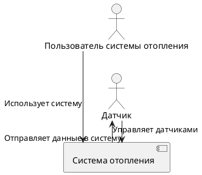
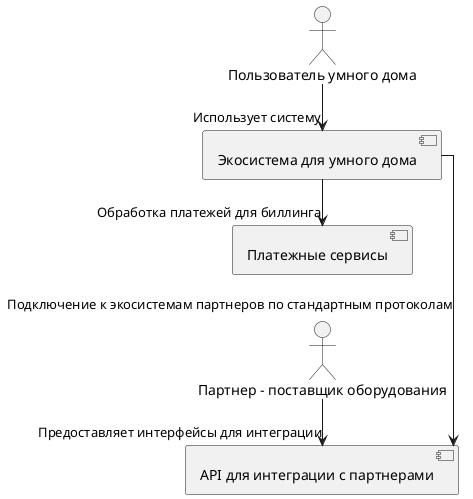
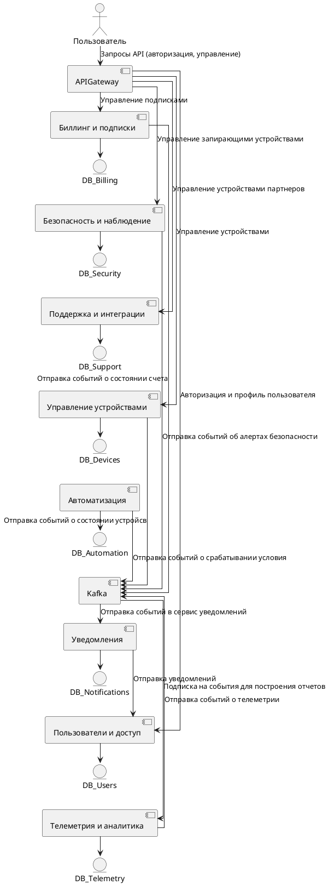
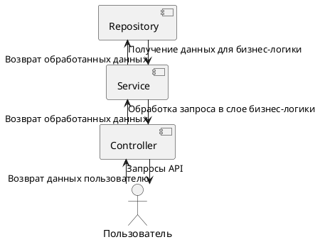
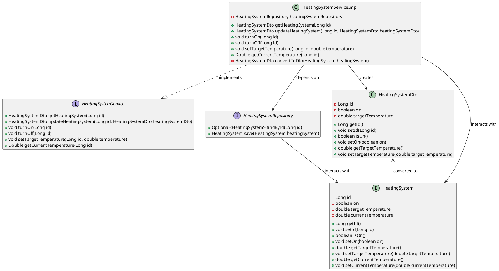
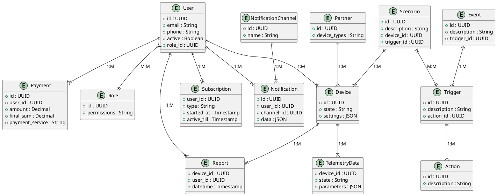

Это шаблон для решения **первой части** проектной работы. Структура этого файла повторяет структуру заданий. Заполняйте его по мере работы над решением.

# Задание 1. Анализ и планирование

Чтобы составить документ с описанием текущей архитектуры приложения, можно часть информации взять из описания компании условия задания. Это нормально.

### 1. Описание функциональности монолитного приложения

**Управление отоплением:**

- Пользователи могут удалённо включать/выключать отопление в своих домах.

**Мониторинг температуры:**

- Пользователи могут просматривать текущую температуру в своих домах через веб-интерфейс.
- Система получает данные о температуре с датчиков, установленных в домах.

### 2. Анализ архитектуры монолитного приложения


    Язык программирования: Java
    База данных: PostgreSQL
    Архитектура: Монолитная.
    Взаимодействие: Синхронное.
    Масштабируемость: Ограничена, так как монолит сложно масштабировать по частям.
    Развёртывание: Требует остановки всего приложения.

Приложение соответствует модели MVC - model, view, controller, и имеет **три слоя логики**. 

**Первый слой** - внешний веб-слой апи.

АПИ приложения имеет такую функциональность:
- Позволяет получить информацию о системе отопления по ее id
- Обновляет информацию о системе отопления.
- Включает систему отопления.
- Выключает систему отопления.
- Устанавливает целевую температуру для системы отопления.
- Возвращает текущую температуру в системе.

**Второй слой** - сервисный.
Сервис как слой бинес-логики принимает параметры из апи и взаимодействует с базой через 
репозиторий, позволяя выполнять все запросы из апи. Соответственно, методы у него те же, 
что и у апи.

**Третий слой**, внутренний, - репозиторий для взаимодействия с БД.   
Здесь представлены две сущности: `HeatingSystem` и `TemperatureSensor`.  
`HeatingSystem` имеет поля: `id, isOn, targetTemperature, currentTemperature`.  
`TemperatureSensor` имеет поля: `id, currentTemperature, lastUpdated`. 

К приложению написаны тесты.

**Инфраструктура** запускается с помощью `Helm`-чарта, который используется для 
развертывания приложения `smart-home-monolith` в `Kubernetes`. 
Управление кластером `Kubernetes` осуществляется через инструмент
`Terraform` - он управляет подами приложения, поддерживает нужное количество реплик и 
следит за их состоянием.

**Развертывание** приложения осуществляется **вручную**, последовательным запуском команд.

### 3. Определение доменов и границы контекстов

Для текущей архитектуры можно выделить два домена: **[Датчики]** и **[Пользователи]**. 

Контексты: управление датчиками, управление данными пользователей и привязанных к ним устройствах

**Домены и контексты для To Be решения описаны в Задании 2.** 

### **4. Проблемы монолитного решения**

Текущее решение не соответсвует целям компании. 
- Приложение получит много новых функций, а количество пользователей увеличится.
Поддерживать большое количество разнородных функций в монолите будет сложно: это увеличит время и сложность разработки
и затормозит релизы. 
- Код будет сильно расширяться и усложняться из-за необходимости поддерживать
новый функционаал, при этом приложение должно отвечать быстро возросшему количеству пользователей.  

Все это невозможно реализовать
в монолитной архитектуре с ручным деплоем. 

### 5. Визуализация контекста системы — диаграмма С4

```
Создайте диаграмму контекста (Context diagram) в модели C4 с помощью PlantUML. Диаграмма должна наглядно показывать, 
как монолитное приложение взаимодействует с внешним миром (пользователи, датчики).
```




# Задание 2. Проектирование микросервисной архитектуры

### 1. Выделение доменов в желаемой реализации
Исходя из описания целевой экосистемы, которую необходимо создать, предлагаю обозначить такие домены и контексты 
(под каждым поддоменом с помощью отступа выделены контексты).

#### 1. Домен: Управление устройствами

        Поддомен: Подключение и управление устройствами

            Регистрация устройств в системе.
            Подключение к экосистеме (локально/через облако).
            Управление состоянием (включение/выключение).
            Настройка параметров (температура, яркость света).

        Поддомен: Мониторинг устройств

            Определение статуса.
            Диагностика неисправностей.
            Отчеты о работе.

#### 2. Домен: Пользователи и управление доступом

        Поддомен: Аутентификация и авторизация
        
            Регистрация, вход, выход.
            OAuth2/JWT авторизация.
            Двухфакторная аутентификация (2FA).
            Другие способы

        Поддомен: Управление ролями и доступом
        
            Создание / назначение прав.
            Другие манипуляции с правами.

        Поддомен: Самообслуживание пользователей
        
            Восстановление пароля.
            Приглашение членов семьи.
            Управление подписками.

#### 3. Домен: Автоматизация и сценарии

        Поддомен: Автоматические правила
        
            Сценарии по условию: «Если температура < 18°C → включить отопление».
            Настройка расписаний (ежедневные, разовые).
            Триггеры по событиям (движение, геолокация).

        Поддомен: Пользовательские сценарии
        
            Программирование логики пользователями.
            Связывание нескольких устройств в сценарии.
            Гибкие условия и таймеры.

#### 4. Домен: Безопасность и наблюдение

        Поддомен: Видеонаблюдение
        
            Стриминг видео с камер.
            Обнаружение движения.
            Хранение записей в облаке/локально.

        Поддомен: Общий контроль доступа
        
            Управление дверями, воротами, замками.
            Гостевой доступ (например, временные коды).
            Логирование входов и выходов.

#### 5. Домен: Телеметрия и аналитика

        Поддомен: Сбор данных
        
            Температура, влажность, потребление энергии.
            Логирование активности устройств.

        Поддомен: Визуализация
        
            Дашборды с графиками и аналитикой.
            Исторические данные об устройстве.

        Поддомен: Интеллектуальные рекомендации
        
            «Снизьте температуру на 2°C для экономии».
            Расчет ожидаемых затрат на электроэнергию.

#### 6. Домен: Уведомления
 
        Поддомен: Каналы уведомлений
        
            Поддержка Telegram, Email, SMS, push и т.д.
            Очереди отправки

        Поддомен: Журнал событий
        
            История отправленных сообщений.
            Фильтрация уведомлений по типам.

#### 7. Домен: Биллинг и подписки
 
        Поддомен: Управление подписками
        
            Поддержка разных типов подписок.
            Управление скидками / спецпредложениями.

        Поддомен: Оплата и учет использования
        
            Оплата через различные платежные сервисы.

#### 8. Домен: Поддержка и интеграции с устройствами партнёров
 
        Поддомен: Партнерские интеграции
        
            Подключение устройств партнёров через API.
            Взаимодействие с поддержкой партнеров.

        Поддомен: Документация
        
            База знаний для пользователей.
            API-документация.

### 2. Создание диаграммы

** Диаграмма контекста (Contexts) **


**Диаграмма контейнеров (Containers)**



**Диаграмма компонентов (Components)**

В целом все микросервисы можно устроить по принципу MVC:



**Диаграмма кода (Code)**

Диаграмма кода сервиса Service:



# Задание 3. Разработка ER-диаграммы

Сущности:

    Device (Устройство)
        -id
        -state
        -settings

    Report (Отчет)
        -device_id
        -user_id
        -datetime

    User (Пользователь)
        -id
        -email
        -phone
        -active
        -role_id

    Role (Роль)
        -id
        -permissions

    Scenario (Сценарий)
        -id
        -device_id
        -description
        -trigger_id

    Trigger (Триггер)
        -id
        -description
        -action_id

    Action (Действие)
        -id
        -description

    Event (Событие)
        -id
        -description
        -trigger_id

    TelemetryData (Данные телеметрии)
        -device_id
        -state
        -parameters

    Notification (Уведомление)
        -id
        -user_id
        -channel_id
        -data

    NotificationChannel (Канал уведомлений)
        -id
        -name

    Subscription (Подписка)
        -user_id
        -type
        -started_at
        -active_till

    Payment (Платеж)
        -id
        -user_id
        -amount
        -final_sum
        -payment_service

    Partner (Партнер)
        -id
        -protocol
        -device_types

Связи: 

Связи "один-ко-многим" (1:M)  
Один User может иметь несколько Device → (User 1:M Device)  
Один Device может генерировать несколько Report → (Device 1:M Report)  
Один User может иметь несколько Report → (User 1:M Report)  
Один User может иметь несколько Notification → (User 1:M Notification)  
Один NotificationChannel может быть связан с несколькими Notification → (NotificationChannel 1:M Notification)  
Один User может иметь несколько Subscription → (User 1:M Subscription)  
Один User может совершать несколько Payment → (User 1:M Payment)  
Один Scenario может быть связан с несколькими Device → (Scenario 1:M Device)  
Один Trigger может запускать несколько Action → (Trigger 1:M Action)  
Один Event может быть связан с несколькими Trigger → (Event 1:M Trigger)  
Один Device может генерировать несколько TelemetryData → (Device 1:M TelemetryData)  
Один Partner может поддерживать несколько типов Device → (Partner 1:M Device)  

Связи "многие-ко-многим" (M:M)  
Один User может иметь несколько Role, а одна Role может принадлежать нескольким User → (User M:M Role)  
Один Scenario может включать несколько Trigger, а один Trigger может быть в нескольких Scenario → (Scenario M:M Trigger)  

